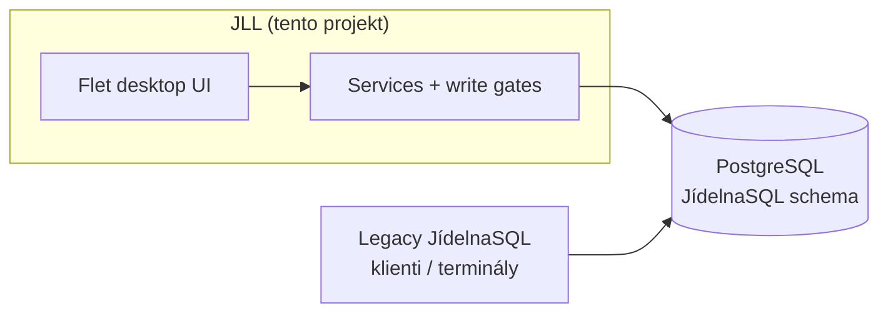
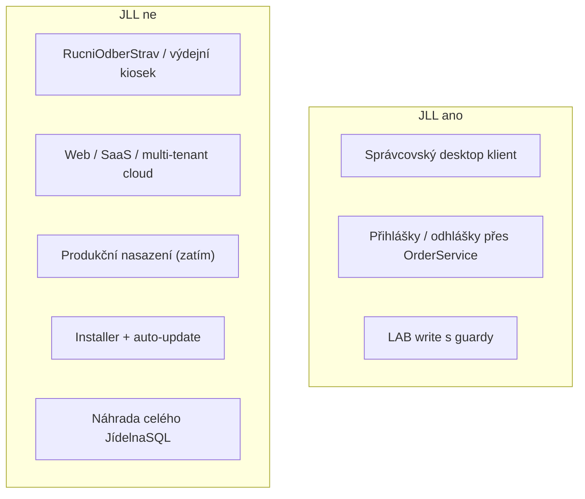
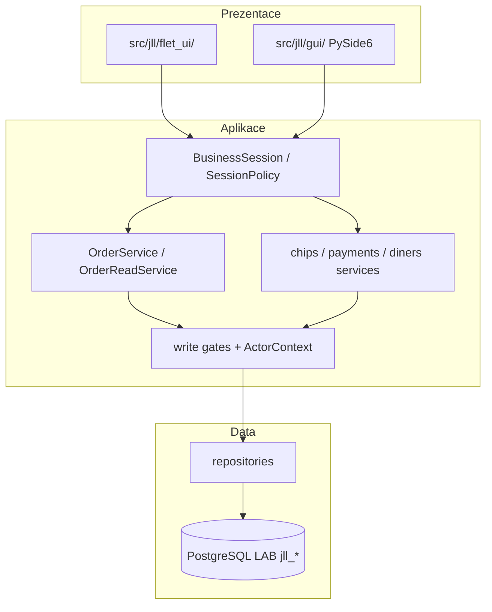
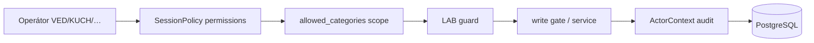
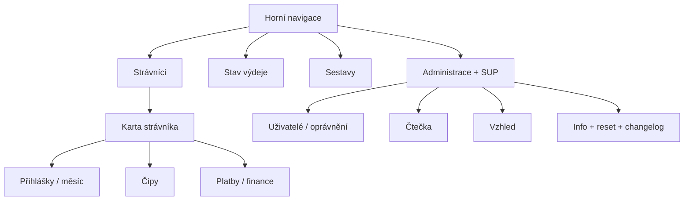

# JidelnaLocalLite (JLL) — přehled pro kolegy

> Verze dokumentu: **0.5.6** · stav: **LAB / pre-production** · produkční write: **zakázán**

Tento dokument je orientační mapa projektu pro člověka, který JLL ještě
nezná. Technické kontrakty a forenzní důkazy jsou v dalších souborech
v `docs/` — tady je „co to je, k čemu to je a co od toho čekat“.

---

## 1. Jednou větou

**JLL je lokální Windows správcovský klient** pro hospodářku jídelny:
najde strávníka, vidí kredit a přihlášky, bezpečně mění menu / odhlašuje,
spravuje čipy a sestavy — nad **existující PostgreSQL databází JídelnaSQL**.

Není to výdejní terminál, není to web a není to náhrada celého JídelnaSQL.



---

## 2. Proč to vzniklo

Legacy prostředí umí provoz, ale správcovský workflow hospodářky je
roztříštěný (hledání, přihlášky, čipy, sestavy, admin).

JLL cílí na:

| Potřeba | Jak to JLL řeší |
| --- | --- |
| Rychle najít strávníka | Seznam + search (jméno / ev. číslo / čip) + ELATEC čtečka |
| Vidět stav | Karta: kredit, kategorie, měsíční mřížka, dnešek |
| Bezpečně měnit objednávku | GUI nepočítá finance — volá `OrderService` |
| Neudělat škody mimo scope | `allowed_categories` + permissions + LAB guard |
| Lokální instalace | Native desktop (Flet), config + keyring na stanici |

Výchozí provozní tok:

```text
start = VED (bez PINu)
  → Strávníci
  → karta strávníka
  → přihláška / odhláška / čipy / platby / sestavy
```

---

## 3. Co JLL UMÍ (aktuálně)

### 3.1 Strávníci

- Scope-safe seznam a vyhledávání (diakritika-insensitive, tokenized AND).
- Karta: údaje, kredit, měsíční přihlášky, jídelníček dne, čipy, historie plateb.
- **Nový strávník** / **Upravit** přes write gates (osobní whitelist polí).
- Změna kategorie: **fail-closed / PARTIAL** (není uzavřený kontrakt).

### 3.2 Přihlášky a odhlášky

- Měsíční mřížka typů stravy; `*` = podle `varnedny` se nevaří.
- Klik do jídelníčku = `menu_add` / `menu_change`; odhlášení = vlastní akce.
- Počet menu z `public.sazby.pocetmenu`, ne z GUI.
- Exkluzivní varianty `Oběd-A..D` přes `OrderService` (včetně applicability
  podle kategorie / `sazby` — fix 0.5.4).
- Klávesy `1..9` pro rychlé menu aktivního typu.
- Provozní Flet session může mít bypass standardních deadline
  (`bypass_order_deadlines`); nevarné dny zůstávají zakázané.

### 3.3 Čipy

- Detail čipu (read), přidělit / vrátit / blokovat / odblokovat / ztracený.
- Záloha `CenaZaPrvniCip = 0` bez finance; `> 0` fail-closed (legacy hotovost).
- ELATEC auto-detekce (COM za běhu); přiložení otevře kartu vlastníka.
- Administrace → Čtečka (AUTO/MANUAL) + SUP.

### 3.4 Platby

- Historie `penden` (typy `P`+`C`) na kartě.
- Ruční zaúčtování přes `public.zapisplatbu` (bez hotovosti/EET, bez
  automatic priority splitu).
- Hotovostní doklad / refund / homebanking vazba: **fail-closed**.

### 3.5 Stav výdeje + sestavy

- Stav výdeje: read-only objednáno / vydáno / zbývá (dnes).
- Sestavy: souhrn kategorií / normy / jmenný seznam; náhled + PDF export
  (volitelně `reportlab`).

### 3.6 Setup, identity, admin

- First-run Setup: DB → provozovna/stanice → kategorie → SUP heslo.
- Default start VED; přepínač uživatelů z `public.uzivatel`.
- Administrace za SUP: uživatelé, oprávnění, čtečka, vzhled, Info.
- **Obnovit počáteční nastavení** (0.5.5+): smaže jen lokální JLL stav
  (config/identity/secrets), **ne databázi**; znovu otevře stejný Setup.
- Changelog v Info je modal (0.5.6), reset zůstává nahoře.

---

## 4. Co JLL NEUMÍ / NENÍ



Konkrétně **není**:

| Očekávání | Realita |
| --- | --- |
| „To je nová jídelna v prohlížeči“ | Ne — lokální Flet desktop |
| „Nahrazuje výdej u okénka“ | Ne — to je `RucniOdberStrav` / terminál |
| „Můžu to dát na ostrý server“ | Ne — LAB only, produkční write blokovaný |
| „Smaže DB při resetu“ | Ne — reset maže jen lokální instalaci JLL |
| „Umí hotovost + EET“ | Ne — fail-closed |
| „Vydává jídlo / účtuje výdej“ | Ne — stav výdeje je read-only |

---

## 5. Technologický stack

| Vrstva | Technologie |
| --- | --- |
| Jazyk | Python 3.12+ |
| Cílové UI | **Flet** (Flutter-rendered desktop) |
| Referenční UI | PySide6 / Qt Widgets (fallback) |
| DB | PostgreSQL, schema JídelnaSQL (`public.*`) |
| Secrets | Windows keyring + file fallback (SUP Argon2id) |
| Čtečka | sériová ELATEC (auto COM) + fake adapter pro testy |
| Testy | pytest unit + LAB integration (jednorázová DB kopie) |
| Verze | `pyproject.toml` → `jll.version.application_version()` |



### Klíčové balíky v kódu

```text
src/jll/
  flet_ui/          cílové UI (app, screens, viewmodels, theme)
  gui/              referenční PySide6
  orders/           objednávkový backend + audit + preflight
  chips/ payments/  čipy a platby
  installation_reset.py   reset lokální instalace (bez DB)
  sup_secret.py     SUP admin secret
  business_session.py
```

---

## 6. Bezpečnostní model (stručně)



1. **LAB guard** — `environment=lab`, loopback host, DB `jll_*`, ověřený
   `system_identifier` clusteru. Jinak aplikace zůstane blokovaná.
2. **Scope** — viditelné jen konfigurované kategorie; vynucuje service SQL,
   ne jen GUI.
3. **Permissions** — např. `diners.view`, `orders.change`, `chips.view`,
   `admin.reader`; GUI jen skrývá/zakazuje, autorita je v service.
4. **SUP** — silné admin heslo JLL (≠ DB heslo uživatele); citlivé admin akce
   vyžadují fresh ověření.
5. **Actor** — zápisy nesou `<instance_id>:<short_code>`, session id,
   `client_version` — nikdy anonymní „JLL“.

---

## 7. Runtime režimy

| Režim | Co to znamená |
| --- | --- |
| **LAB** | Jediný povolený běh; testovací DB; write gated |
| **Produkce** | Explicitně **není** povolena |
| First-run | Setup Wizard vytvoří `config/lab.json` + identity + SUP |
| Reset instalace | Zapomene lokální JLL stav → znovu Setup; DB beze změny |

Spuštění (Git Bash):

```bash
./tools/run_jll_flet_lab.sh          # cílové UI
./tools/run_jll_lab.sh               # PySide6 reference
./tools/run_jll_flet_lab.sh --probe-only
```

---

## 8. Mapa obrazovek (Flet)



---

## 9. Co je hotové vs. otevřené

| Oblast | Stav |
| --- | --- |
| Flet desktop UX | aktivní cíl (~0.5.x) |
| Order write LAB | implementováno + audit; mixed-writer s legacy = blocker |
| Čipy write | částečně; deposit > 0 fail-closed |
| Diner create/edit | částečně; category change PARTIAL |
| Platby (ne-hotovost) | historie + `zapisplatbu` |
| ELATEC auto | implementováno; fyzické HIL neuzavřené |
| Produkční scope/identity | návrh existuje, není uzavřené |
| Installer / update | neexistuje |

**P1 roadmap (orientačně):** HIL čtečka, autoritativní chip + diner write
kontrakty. **P2:** produkční server-side scope, centrální identity, installer.

---

## 10. Kde číst dál

| Téma | Dokument |
| --- | --- |
| Kořenový README | [`../README.md`](../README.md) |
| Flet architektura | [`JLL_FLET_ARCHITECTURE.md`](JLL_FLET_ARCHITECTURE.md) |
| Setup / identity / admin | [`JLL_SETUP_IDENTITY_PERMISSIONS_ADMIN.md`](JLL_SETUP_IDENTITY_PERMISSIONS_ADMIN.md) |
| Reset instalace | [`JLL_INSTALLATION_RESET_SPEC_0.5.5.md`](JLL_INSTALLATION_RESET_SPEC_0.5.5.md) |
| Platby | [`JLL_PAYMENT_CONTRACT_0.4.0.md`](JLL_PAYMENT_CONTRACT_0.4.0.md) |
| Čipy / ELATEC | [`JLL_CHIP_MODULE.md`](JLL_CHIP_MODULE.md), [`JLL_ELATEC_AUTO_DETECTION_0.4.2.md`](JLL_ELATEC_AUTO_DETECTION_0.4.2.md) |
| Index docs | [`README.md`](README.md) |
| Historie verzí | [`../CHANGELOG.md`](../CHANGELOG.md) |

---

## 11. Jednověté shrnutí pro onboarding

> JLL je **LAB správcovský desktop** nad JídelnaSQL: hospodářka řídí
> strávníky, přihlášky, čipy a sestavy přes Flet UI a přísné service
> kontrakty. **Neřeší výdej u okénka, neběží v produkci a nikdy nesmí
> tiché přepisovat legacy finance mimo `OrderService` / write gates.**
